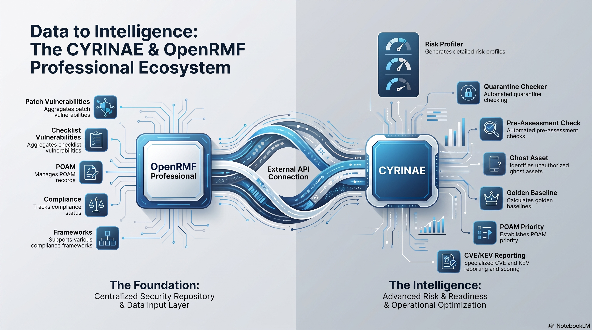

# CYRINAE Portfolio Manager Scripts

CYRINAE = Cyber Risk Integrated Automation Engine

## What this is For

This repo is for Python, Pandas and other libraries to do higher level processing of cyber compliance, hygiene, and security data.

This is used for testing python and pandas processing on larger CSV type datasets exported from [OpenRMF Professional](https://www.soteriasoft.com/products/openrmf-professional.html) by [Soteria Software](https://www.soteriasoft.com).

We leverage the APIs in the <a href="https://github.com/SoteriaSoftwareLLC/openrmfpro-automation">Automation Repo</a> and combine them here to do higher level features and calculations using your OpenRMF&reg; Professional data.

CYRINAE is the all encompassing solution of the following items:
- OpenRMF Professional
- Elastic AI Service Provider Interface (SPI)
- Elastic SIEM SPI
- Slack SPI
- Email SPI
- Portfolio Manager (currently under development)

## How this is Used

This repo has <a href="./scripts">scripts</a> to call APIs with examples as well.  It is organized by topic and area of cyber compliance, hygiene, and security.  It also has example .csv files exported from data in OpenRMF Professional. And it has higher level python scripts to call the OpenRMF Professional external API and process information. 

The <a href="./scripts">scripts</a> is the best place to start to see the main ideas around risk profiling, POAM prioritization, overview PDFs and more. 

## Available Scripts
The scripts available are below. And we have other ones copied from our GH public automation repo at https://github.com/SoteriaSoftwareLLC/openrmfpro-automation/ to show how you use them to do higher level work. 

Most of the scripts below you pass in the root URL, your OpenRMF&reg; Professional application key, the token, and then your systemKey. See comments in the scripts if more is required. 

| Script | Description |
| -------- | ---------------------------------- |
| <a href="./scripts/system-package/get_systempackage_by_systemkey_overview_pdf.py">System Package Overview PDF</a> | Creates a PDF for main points in your system package  |
| <a href="./scripts/poam/get_systempackage_by_systemkey_poam_raw_severity_overview_pdf.py">System Package POAM Raw Severity PDF</a> | Creates a PDF for your POAM risk data based on raw severity of items |
| <a href="./scripts/poam/get_systempackage_by_systemkey_poam_residual_risk_overview_pdf.py">System Package POAM Residual Risk PDF</a> | Creates a PDF for your POAM risk data based on your residual risk of items |
| <a href="./scripts/risk-profiler/risk_profiler_pdf.py">Risk Profiler PDF</a> | Create a PDF using the thresholds in the settings file to run a risk profiler on all your system package data |
| <a href="./scripts/CMMC/calculate_cmmc_score.py">CMMC Score (WIP)</a> | Calculate your pass/fail and score for CMMC 2.0 Level 1, 2 or 3 -- still a work in progress |
| <a href="./scripts/configuration-overlap/configuration_overlap_pdf.py">Golden Baseline</a>| Mathematically discover what the actual baseline is across your infrastructure, and isolate the outliers. |
| <a href="./scripts/roi-ranker/poam_prioritization_pdf.py">POAM Prioritizing</a>| Optimization, weighted scoring algorithms, categorical data handling of POAM items to show greatest impact for prioritizing work. |
| <a href="./scripts/assessment/preassessment_checker_pdf.py">Pre-Assessment Checker</a>| Check that you are ready for assessment with high level checks across all your compliance data and vulnerabilities. |
| <a href="./scripts/ghost-asset/ghost_asset_pdf.py">Ghost Assets</a>| Find if there are assets in your listing across hardware, checklists, and ports/protocols/services that are not related to devices in your system package. |
| <a href="./scripts/quarantine-checker/quarantine_checker_pdf.py">Quarantine Testing</a>| Based on settings, find devices that meet certain criteria that warrant investigating for quarantine. |
| <a href="./scripts/patch-vulnerability/patch_vulnerability_cve_pdf.py">Patch CVE Listing</a>| Show your open patch vulnerabilities with CVE data matching the CVEs listed in patch descriptions (if any) with scores. Generate <a href="./example-data-files/cve/README.md">CVE main CSV data</a> first.|
| <a href="./scripts/patch-vulnerability/patch_vulnerability_kev_pdf.py">Patch KEV Listing</a>| Show your open patch vulnerabilities with KEV data matching the CVEs listed in patch descriptions (if any) with dates. Download <a href="./example-data-files/kev/README.md">KEV data</a> first.|
| <a href="./scripts/patch-vulnerability/patch_vulnerability_cve_with_kev_pdf.py">Patch CVE &amp; KEV Listing</a>| Show your open patch vulnerabilities with CVE and KEV data matching the CVE IDs listed in patch descriptions (if any) with dates. Generate <a href="./example-data-files/cve/README.md">CVE main CSV data</a> and download <a href="./example-data-files/kev/README.md">KEV data</a> first.|
| Container Scan CVE Listing| Show your open container scan vulnerabilities with CVE data matching the CVE IDs listed in patch descriptions (if any) with scores. |
| Container Scan KEV Listing| Show your open container scan vulnerabilities with KEV data matching the CVE IDs listed in patch descriptions (if any) with dates. |
| Container Scan CVE &amp; KEV Listing| Show your open container scan vulnerabilities with CVE and KEV data matching the CVE IDs listed in patch descriptions (if any) with dates. |